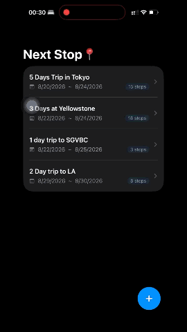
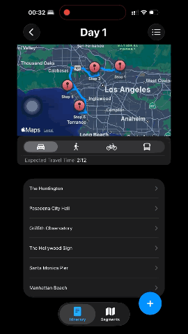

# NextStop

A travel itinerary iOS app for planning multi-day trips with route visualization and ETA estimation.

**Quick Demo**: 

  

    
<b>Create Trip</b>

    
  

  

    
<b>Route Planning</b>

    
  

  

    
<b>Location Information</b>

    
  

## Overview

NextStop lets you organize trips by day, add stops to each day, and visualize the full route on a map. Each trip shows a polyline route across all stops, real-time ETA by transport mode, and per-segment navigation cards with Apple Maps integration.

## Features

- **Trip Management** — Create trips with start/end dates; days are auto-calculated
- **Stop Management** — Add, reorder, and delete stops per day via search
- **Route Visualization** — Polyline map rendered across all stops in order
- **ETA Calculation** — Total trip ETA with support for driving, walking, cycling, and transit
- **Segment View** — Per-segment ETA cards; tap a card to focus the map on that leg
- **Apple Maps Integration** — Launch turn-by-turn navigation directly from any segment
- **Persistent Storage** — All trip and stop data saved locally via SwiftData

## Tech Stack

- **SwiftUI** — Declarative UI with `TabView`, `NavigationStack`, `@State`, `@Binding`
- **SwiftData** — Local persistence with `@Model`, `@Query`, and `@Relationship`
- **MapKit** — `MKMapView` via `UIViewRepresentable`, `MKDirections`, `MKPolyline`
- **Swift Concurrency** — `async/await`, `withTaskGroup` for parallel route fetching, `Task` debouncing
- **Observation** — `@Observable` view model for reactive route state
